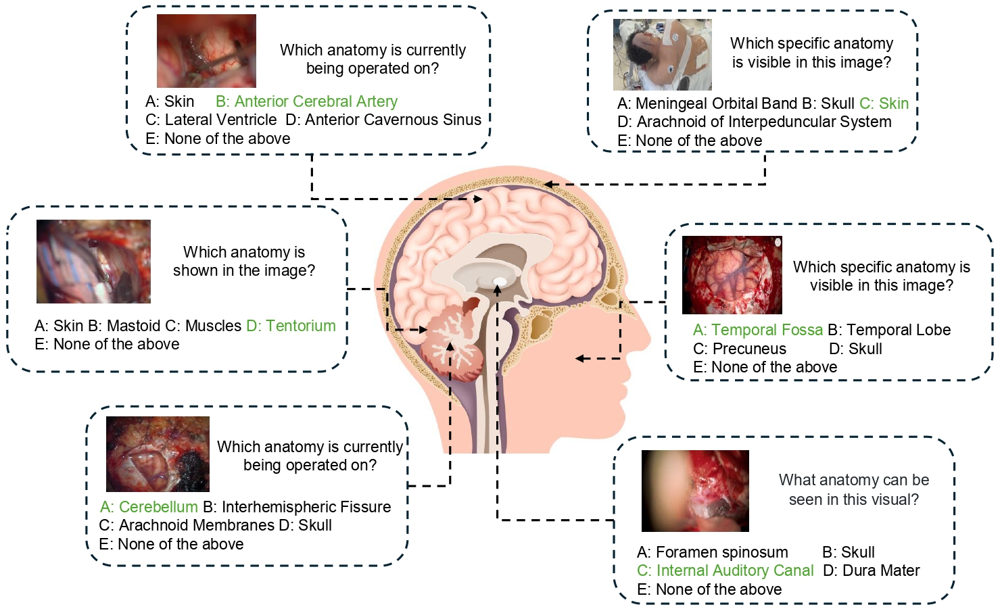
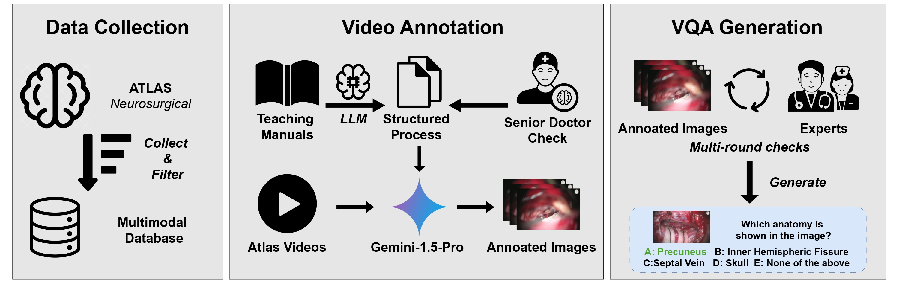

# ICIA_NeuroABench

## 📝 Overview
Our paper introduces **NeuroABench**, a new multimodal benchmark for evaluating anatomical understanding in neurosurgical videos, and finds that while state-of-the-art multimodal large language models show promise, they still fall short of human-level performance in anatomical identification tasks.  

<figure>
  
  <figcaption><b>Figure 1:</b> Examples of NeuroABench. This benchmark is constructed using neurosurgical anatomical content derived from publicly available educational videos.</figcaption>
</figure>

<figure>
  
  <figcaption><b>Figure 2:</b> <b>Pipeline illustration of NeuroABench.</b> The data collection can be divided into three main steps: 1) We search hundreds of videos and teaching
manuals from the Neurosurgical Atlas, then keep 89 high-quality videos and 32 teaching manuals after filtering. 2) We use Gemini-1.5-Pro to annotate videos
with the instructions of clinician-reviewed structured progress extracted from teaching manuals. 3) The annotated images go through additional validation and
experts’ selection. From these images, we generate question-and-answer pairs for each landmark anatomy featured in the videos.</figcaption>
</figure>

## 📚 Dataset

The benchmark text data used in this project is provided in the xxx.json file.

Please note: Benchmark images are not included in this repository.
The benchmark images can be downloaded from [this link](https://example.com/download-link).

## ✍ Testing Results 

#### Open-Source MLLMs

| Model                  | Acc   | Precision | Recall | F1    |
|------------------------|-------|-----------|--------|-------|
| mPLUG-Owl3             | 25.76 | 20.37     | 25.36  | 22.55 |
| Deepseek-VL2*          | 22.54 | 16.06     | 23.35  | 16.93 |
| LLaVA-NeXT             | 28.82 | 24.06     | 28.90  | 25.67 |
| Baichuan-Omni-1.5      | 27.25 | 27.90     | 27.22  | 27.29 |
| Qwen2.5-VL             | 31.21 | 33.69     | 32.18  | 32.15 |
| LLaVA-NeXT             | 27.53 | 26.70     | 27.43  | 25.45 |
| Qwen2.5-VL             | 37.44 | 40.57     | 37.27  | 37.52 |

#### Proprietary MLLMs

| Model                  | Acc   | Precision | Recall | F1    |
|------------------------|-------|-----------|--------|-------|
| GPT-4o                 | 30.21 | 38.19     | 29.59  | 29.93 |
| Gemini-1.5-Pro         | 38.83 | 41.93     | 39.82  | 35.88 |
| Gemini-2.0-Flash       | 40.87 | 46.61     | 41.07  | 38.56 |
| Qwen-VL-MAX            | 16.46 | 18.26     | 18.31  | 12.13 |
| Claude-3.5-Sonnet      | 41.51 | 42.52     | 41.34  | 38.14 |
| Claude-3.7-Sonnet      | 33.27 | 37.63     | 33.11  | 30.98 |

#### Medical Special Models

| Model                  | Acc   | Precision | Recall | F1    |
|------------------------|-------|-----------|--------|-------|
| LLaVA-Med-v1.5         | 15.01 | 12.54     | 15.09  | 7.66  |
| HuatuoGPT-Vision       | 30.31 | 34.40     | 30.87  | 28.31 |
| HuatuoGPT-Vision       | 35.48 | 36.52     | 36.40  | 32.71 |
